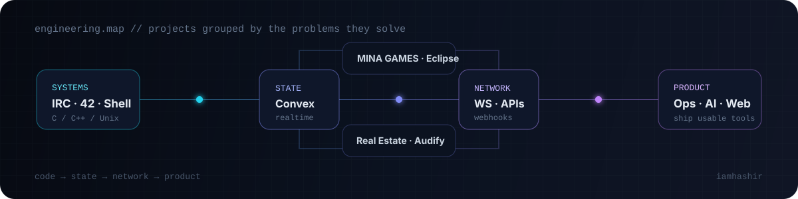

<div align="center">


<br/>

<a href="https://cv-portfolio-five.vercel.app"></a>
<a href="https://linkedin.com/in/malikhashir"></a>

</div>

## `whoami`

```text
Malik Hashir
Software Engineer · Abu Dhabi, UAE

I like software where the interesting part is below the screen:
state machines, sockets, data models, synchronization, APIs and the edge cases between them.
```



## `selected_work/`

<table>
<tr>
<td width="50%" valign="top">

### [MINA GAMES / ft_transcendence](https://github.com/minapong/ft_transcendence)

**Collaborative realtime multiplayer platform** in the `minapong` organization.

WebSockets, Fastify, SQLite/Prisma, Docker/NGINX, tournaments and multiple games. My work includes product/project ownership, frontend architecture, backend integration and the custom **Reactor** JSX/runtime system.

`realtime` `architecture` `typescript` `websockets`

</td>
<td width="50%" valign="top">

### [IRC](https://github.com/iamhashir/IRC)

**Non-blocking IRC server in C++98.**

TCP sockets, `poll()`, per-client read/write buffers, IRC parsing, command dispatch, registration state, channels, modes and disconnect/error handling.

`c++` `networking` `poll` `protocols`

</td>
</tr>
<tr>
<td width="50%" valign="top">

### [Eclipse / secret-hitler](https://github.com/iamhashir/secret-hitler)

**Server-authoritative realtime social-deduction game.**

Convex owns the game state machine: elections, policy decks, legislative sessions, executive powers, win conditions and scheduled bot decisions. The React client focuses on projecting that state cleanly.

`next.js` `convex` `state-machines` `realtime`

</td>
<td width="50%" valign="top">

### [Real Estate Management](https://github.com/iamhashir/real_estate_management)

**Operations software for a real-estate workflow.**

Properties, clients, agents, deal stages, commissions, search, activity history and reporting in one full-stack application.

`next.js` `typescript` `convex` `product-engineering`

</td>
</tr>
<tr>
<td width="50%" valign="top">

### [Customer Service Agent](https://github.com/iamhashir/Customer_service_agent)

**WhatsApp Cloud API automation.**

Meta webhooks, intent routing, conversational state, guided product flows, response rendering and human handoff.

`node.js` `webhooks` `automation` `apis`

</td>
<td width="50%" valign="top">

### [Audify](https://github.com/iamhashir/Audify)

**AI audio publishing application.**

Text-to-speech generation, AI/custom artwork, authentication, publishing, search/discovery and Convex-backed media/data workflows.

[open app ↗](https://audify-coral.vercel.app)

`next.js` `openai` `convex` `clerk`

</td>
</tr>
</table>

## `systems_depth/`

The application projects are only half of the story.

- [`42curcus`](https://github.com/iamhashir/42curcus) — consolidated progression through C/C++, Unix, graphics, processes, networking, Docker and realtime systems
- [`MINISHELLING`](https://github.com/iamhashir/MINISHELLING) — tokenizer → parser/AST → expansion → heredoc → pipelines/redirections → process execution
- [`philo`](https://github.com/iamhashir/philo) — pthreads, mutexes, shared-state synchronization and timing
- [`Twitter_clone`](https://github.com/iamhashir/Twitter_clone) — despite the name, a native C++/openFrameworks tweet-data visualization project
- [`Code-Smith`](https://github.com/iamhashir/Code-Smith) — authenticated fee/report workflow with PDF/XLSX/CSV generation; documented as the prototype it actually is

## `stack != identity`

```text
frontend      React · Next.js · React Native / Expo · TypeScript
backend       Node.js · Fastify · APIs · Webhooks · Convex · Supabase
realtime      WebSockets · server-authoritative state · synchronization
systems       C · C++ · Unix · sockets · poll · pthreads · processes
infra/data    PostgreSQL · SQLite · Prisma · Docker · NGINX · Vercel
AI            OpenAI APIs · local model experiments · workflow automation
```

I use the stack that fits the problem; the repository should show the engineering decisions, not just a badge wall.

## `private_work/`

Some of my strongest operational/mobile work is private because it contains business or client context. That work includes offline-first mobile state, SQLite caching/synchronization, OCR-assisted workflows and Supabase-backed operational systems.

I keep public case-study claims sanitized rather than publishing private business data.

## `more/`

- [full repository audit →](./REPOSITORIES.md)
- [account consolidation notes →](./ACCOUNT_CONSOLIDATION.md)
- [engineering portfolio →](https://cv-portfolio-five.vercel.app)
- [LinkedIn →](https://linkedin.com/in/malikhashir)

---

<div align="center">

<sub>Historical GitHub contributions may also appear under <code>ihashirr</code>. That is my legacy account; <code>iamhashir</code> is the active profile.</sub>

</div>
