<div align="center">



<br/>

<a href="https://cv-portfolio-five.vercel.app"><b>Portfolio</b></a>
&nbsp;&nbsp;·&nbsp;&nbsp;
<a href="https://linkedin.com/in/malikhashir"><b>LinkedIn</b></a>
&nbsp;&nbsp;·&nbsp;&nbsp;
<a href="https://github.com/iamhashir?tab=repositories"><b>Repositories</b></a>

</div>

## I build software where the interesting part is below the screen.

Full-stack web and mobile products, realtime systems, low-level C/C++, and AI-assisted workflows. I care most about the parts that become difficult once software has real state: synchronization, protocols, data models, offline behavior, automation, and operational edge cases.

---

## Flagship — MINA GAMES / Reactor

<table>
<tr>
<td width="64%" valign="top">

### [MINA GAMES — ft_transcendence](https://github.com/minapong/ft_transcendence)

A **4-person realtime multiplayer platform** built at 42 Abu Dhabi with Pong, Connect 4, matchmaking, tournaments, profiles, statistics, social features, persistent data and containerized deployment.

My role covered **product ownership, project coordination and development**. My main engineering ownership was the frontend foundation: **Reactor**, a custom JSX runtime/framework built for the project.

Reactor includes:

- custom JSX runtime
- hook-style state and lifecycle handling
- client-side routing
- deterministic rendering without a Virtual DOM
- framework-level modal/layout orchestration

I also contributed to the social/user layer and Fastify integration.

**TypeScript · Fastify · WebSockets · Prisma · SQLite · Docker · NGINX**

</td>
<td width="36%" valign="top">

### Engineering signal

```text
TEAM        4 developers
WORKFLOW    70+ reviewed PRs
FRONTEND    custom JSX runtime
REALTIME    WebSockets
BACKEND     Fastify
DATA        Prisma + SQLite
DELIVERY    Docker + NGINX
```

[open repository →](https://github.com/minapong/ft_transcendence)

</td>
</tr>
</table>

---

## Private systems / case studies

<table>
<tr>
<td width="50%" valign="top">

### Mess Manager
**Offline-first mobile operations app** · private repository

React Native / Expo application for meal-service operations: customers, subscriptions, menus, attendance, payments, expenses and one-time orders.

The interesting part is the data path: **SQLite-first writes, dirty-record protection, a persistent sync queue, retry/failure state, remote reconciliation and OCR-assisted receipt entry with ML Kit**.

`React Native` `Expo` `SQLite` `Firebase` `OCR`

</td>
<td width="50%" valign="top">

### UI Analyzer
**Local AI + browser automation** · private case study

An automated UI-auditing workflow built around **Mistral running locally through llama.cpp**, browser extraction with **Playwright**, and **OCR/data extraction** to turn interfaces into analyzable structure without depending entirely on hosted model APIs.

`Python` `llama.cpp` `Mistral` `Playwright` `OCR`

</td>
</tr>
</table>

---

## Public code worth opening

<table>
<tr>
<td width="50%" valign="top">

### [IRC](https://github.com/iamhashir/IRC)
**C++98 network server**

Non-blocking TCP sockets, `poll()`, buffered client I/O, IRC parsing/dispatch, registration state, channels, modes and disconnect/error handling.

`C++` `sockets` `poll` `protocols`

</td>
<td width="50%" valign="top">

### [Eclipse / secret-hitler](https://github.com/iamhashir/secret-hitler)
**Realtime state-machine game**

Next.js client with a Convex-backed authoritative game engine covering elections, policy decks, legislative sessions, executive powers, win conditions and scheduled bot decisions.

`Next.js` `Convex` `state machines` `realtime`

</td>
</tr>
<tr>
<td width="50%" valign="top">

### [Real Estate Management](https://github.com/iamhashir/real_estate_management)
**Business workflow software**

Properties, clients, agents, deal stages, commissions, activity history, search and reporting built as one operational application rather than disconnected CRUD screens.

`Next.js` `TypeScript` `Convex`

</td>
<td width="50%" valign="top">

### [MINISHELLING](https://github.com/iamhashir/MINISHELLING)
**Unix shell implementation**

Tokenizer and parser/AST, environment expansion, heredocs, pipes/redirections, built-ins, path resolution, process execution and signal handling.

`C` `Unix` `processes` `file descriptors`

</td>
</tr>
</table>

---

## Background

```text
42 Abu Dhabi        Software Development & AI Applications · 2024 — present
Bath Spa University BSc Creative Computing (Hons)              · 2020 — 2023
Freelance            web / mobile / automation systems          · current
Technical operations Etihad Arena & ADNEC                       · 2023 — 2025
Location             Abu Dhabi, UAE
```

## Working set

`TypeScript` · `JavaScript` · `React` · `Next.js` · `React Native / Expo` · `Node.js` · `Fastify` · `WebSockets` · `Convex` · `Supabase` · `Firebase` · `SQLite` · `PostgreSQL` · `Prisma` · `C` · `C++` · `Docker` · `NGINX` · `OpenAI APIs` · `Mistral / llama.cpp` · `Playwright` · `OCR`

---

<div align="center">

<a href="./REPOSITORIES.md"><b>implementation-first repository audit →</b></a>

<br/><br/>

<sub>Historical contributions may also appear under <code>ihashirr</code>. <code>iamhashir</code> is my active GitHub identity.</sub>

</div>
